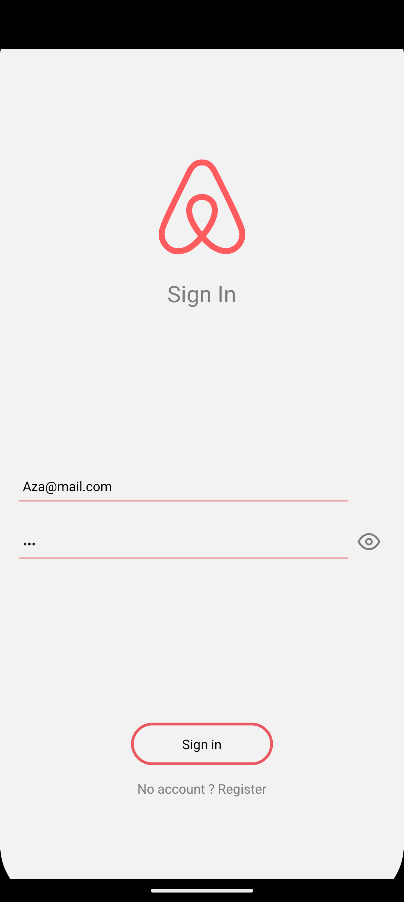
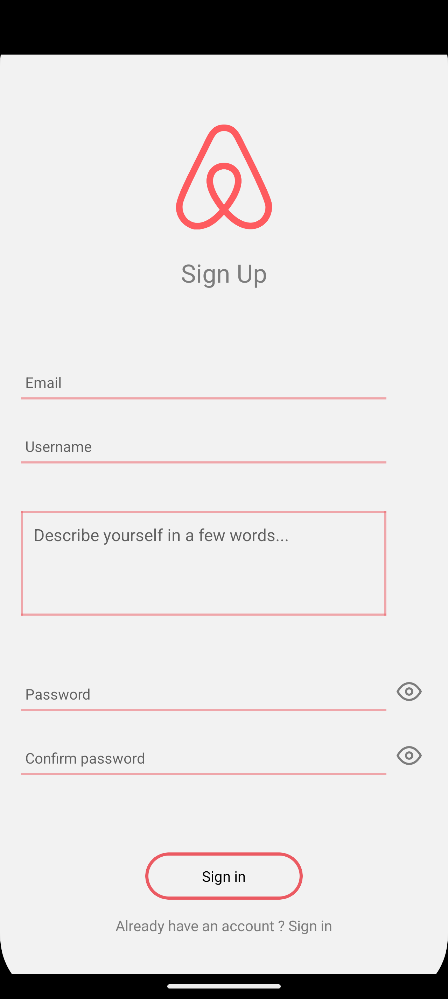
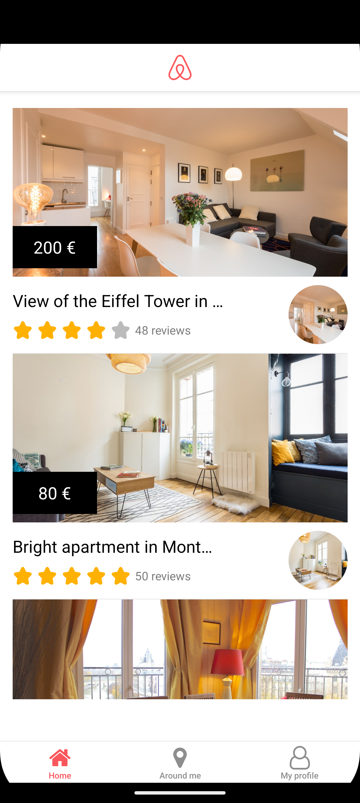
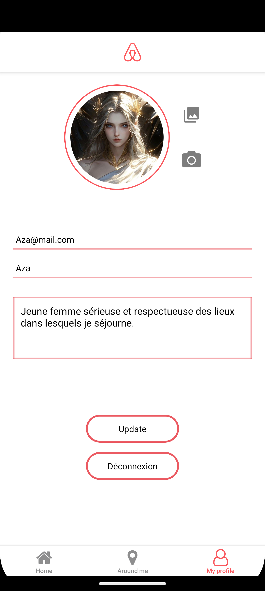

# 🎨 Airbnb réplique - Frontend

## 📌 Description

Ce projet est une réplique de la célèbre plateforme de location de biens immobiliers Airbnb, réalisé dans le cadre de ma formation au Reacteur.

L’objectif principal était la prise en main de React Native avec Expo Router, l’utilisation de l’AsyncStorage, ainsi que la mise en place de Contexts pour la gestion d’état global.

## Architecture

```
app/
├── (auth)/
│   ├── _layout.js           # Stack layout pour l'authentification
│   ├── index.js             # Page de connexion
│   └── signup.js            # Page d'inscription
│
├── (main)/
│   ├── _layout.js           # Tab layout pour les pages principales
│   ├── map.js               # Carte avec localisation des biens
│   ├── profile.js           # Page de profil utilisateur
│   └── (home)/
│       ├── home.js          # Page d'accueil avec la liste des biens
│       └── room.js          # Détail d’un bien
│
└── _layout.js               # Slot layout global
```

## 🚀 Démo/Présentation du projet


## 🛠️ Technologies utilisées

- React Native
- Expo Router
- Axios
- expo-constants
- KeyboardAwareScrollView
- react-native-maps
- AsyncStorage
- expo-location
- expo/vector-icons
- expo-image-picker

## 📦 Installation

```bash
git clone https://github.com/CedrineM/airbnb-replique
cd airbnb-replique
yarn
yarn start
```

## 📸 Captures d'écran (exemple de page)

### Page Signin/Signup




### Page d'acceuil



### Page Profile



## 🔧 Fonctionnalités

✅ Authentification (connexion / inscription)  
✅ Gestion de profil (modification des infos perso)  
✅ Accueil (liste des biens disponibles)  
✅ Pièce (page de description détaillée d’un bien)  
✅ Carte interactive (localisation des biens autour de l'utilisateur — actuellement uniquement Paris)

## ✍️ Auteurs

[@CedrineM](https://github.com/CedrineM)
